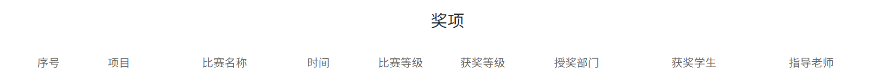

# 官网的数据

## 首页：

首页的分成若干个块，每个块都有以下的数据

| 图片 | 标题 | 介绍                                     |
| ---- | ---- | ---------------------------------------- |
| url  | text | 介绍中每一行作为一端，段与段之间用\n隔开 |

## 我们：

### 重要时刻：

分为七张图，每张图都有如下的数据

| 图片 | 名字 | 称号 | 介绍 |
| ---- | ---- | ---- | ---- |
| url  | text | text | text |

### 指导老师：

强哥和李杨老师

| 头像 | 介绍                                     |
| ---- | ---------------------------------------- |
| url  | 介绍中每一行作为一端，段与段之间用\n隔开 |

### 组别：

| 图片（两张，一张是选中的一张是没有选种的装的） | 组名 | 组别介绍 |
| ---------------------------------------------- | ---- | -------- |
| url                                            | text | text     |

### 最近荣誉：

| 图片列表 | 标题 | 年份 | 简介 |
| -------- | ---- | ---- | ---- |
| url      | text | text | text |

设立三种显示方案

## 成员：

| 头像 | 名字 | 年级，格式为一下（2018） | 组别 |
| ---- | ---- | ------------------------ | ---- |
| url  | text | text                     | text |

- 年级格式：201X

- 组别格式：

- 前端组:

  后台组:

  嵌入式组:

  数据挖掘组

  移动组

  图形渲染组

  设计师组

## 项目：

展示的项目有若干个：

| 图片 | 介绍 |
| ---- | ---- |
| url  | text |

## 荣誉：

奖项：

 新闻链接

专利

软件著作权

## 专栏：

### QG特色：

可动态添加以及修改

| 标题 | 图片组   | 介绍 |
| ---- | -------- | ---- |
| text | 多个图片 | text |

### QG发展史：

可动态添加以及修改

| 标题 | 图片组   | 介绍 |
| ---- | -------- | ---- |
| text | 多个图片 | text |

// fromdata

// 